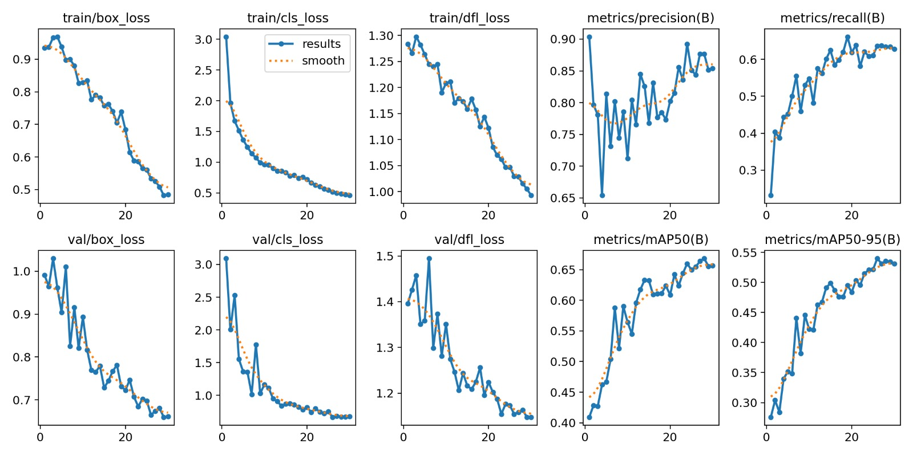
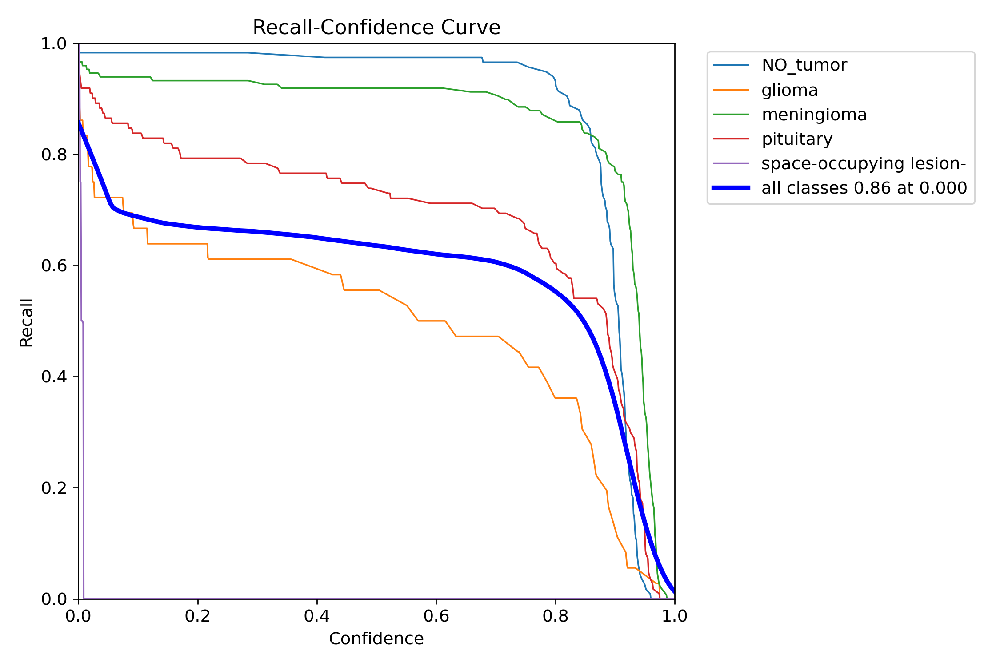

# <p align="center">🧠 NeuroScan AI: Triple-Model Brain Tumor Suite</p>

---

## 📊 Project Analytics & Performance
AIIMS Delhi Research Framework ke basis par banaya gaya ye model 50 Epochs par train kiya gaya hai.

### **Training Metrics (Loss & Accuracy)**
<p align="center">
  
</p>

### **Statistical Validation**
Tumor detection aur classification ki accuracy ko in graphs se validate kiya gaya hai:
<p align="center">
   
  
  
</p>

---

## 🖼️ Clinical Interface & Segmentation
Project ka main dashboard aur segmentation result niche diye gaye hain:

### **1. User Interface (Dashboard)**
<p align="center">
  
</p>

### **2. Precision Segmentation & Severity**
SAM2 aur YOLOv11 ka use karke pixel-level segmentation aur area ratio calculate kiya gaya hai.
<p align="center">
  
</p>

---

## 📂 Model Weights (Required Files)
Project ko run karne ke liye ye files main directory mein honi chahiye:
* **VGG16 Classification:** `final_weights.weights.h5`
* **YOLOv11 Localization:** `best (5).pt`
* **SAM2 Segmentation:** `sam2_b.pt`

---

## ⚙️ How to Run this Project

1. **Clone the Repository:**
   ```bash
   git clone [https://github.com/kratika-agarwal19/Brain-Tumor-Detection-SAM2-YOLOv11.git](https://github.com/kratika-agarwal19/Brain-Tumor-Detection-SAM2-YOLOv11.git)
   cd Brain-Tumor-Detection-SAM2-YOLOv11
