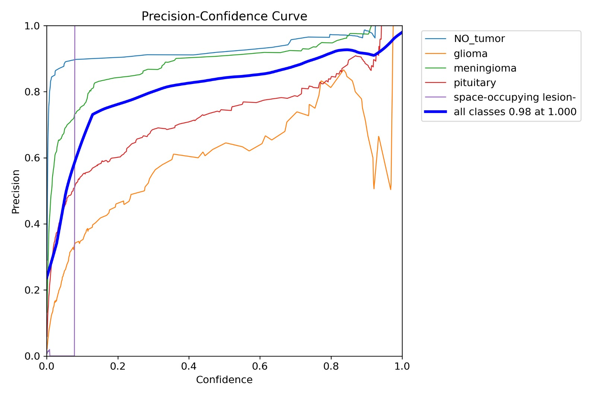
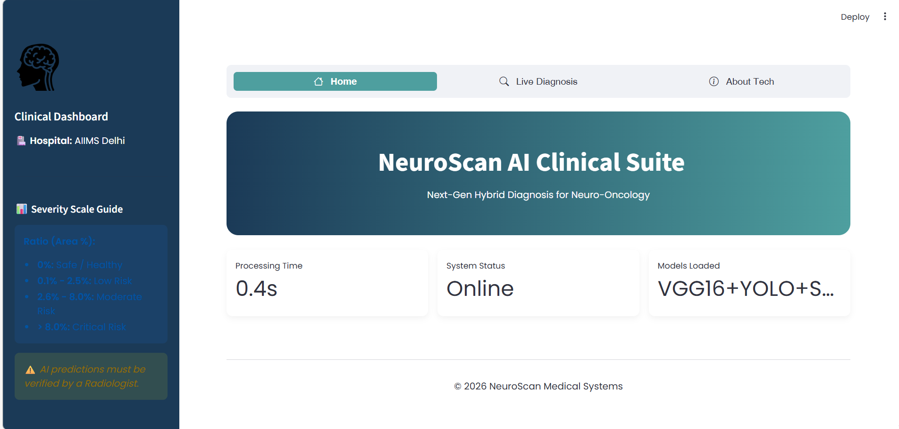
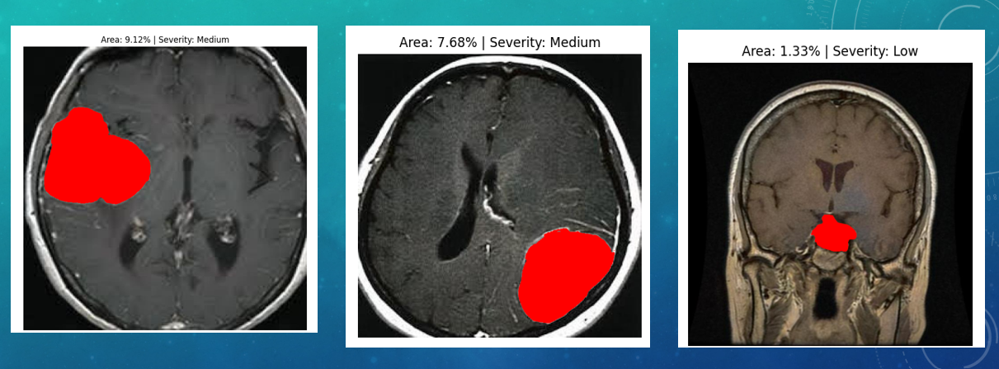

# <p align="center">🧠 NeuroScan AI: Precision Neuro-Oncology Suite</p>
<p align="center"><i>An Integrated Pipeline for Brain Tumor Classification, Localization, and Segmentation</i></p>

---

## 📊 Model Training & Performance Analytics
The system is built upon the **AIIMS Delhi Research Framework**, trained over 50 epochs to ensure high clinical reliability and diagnostic accuracy.

### 📈 Training Metrics (Loss & Accuracy)
The following visualization illustrates the loss convergence and accuracy trends during the training phase:
<p align="center">
  
</p>

### 🔬 Statistical Validation
Our models are validated using standard clinical metrics including Precision, Recall, and F1-Score to ensure minimal false negatives.
<p align="center">
   
  
  
</p>

---

## 🖥️ Clinical Dashboard & Segmentation Result
The following images showcase the live deployment of the **VGG16 + YOLOv11 + SAM2** hybrid pipeline.

### 🌐 System Interface (Streamlit Dashboard)
The dashboard allows radiologists to upload MRI scans and receive automated diagnostic insights, including pathology type and confidence scores.
<p align="center">
  
</p>

### 🧩 Automated Tumor Segmentation
The segmentation engine identifies the exact tumor boundary and calculates the **Tumor-to-Brain Area Ratio** for automated severity assessment.
<p align="center">
  
</p>

---

## 🛠️ Technology Stack
* **Pathology Classification:** VGG16 (Transfer Learning)
* **Object Localization:** YOLOv11 (Real-time Detection)
* **Mask Segmentation:** SAM2 (Meta AI - Segment Anything Model)
* **Web Interface:** Streamlit (Python Framework)


---

## 📂 Project Structure & Model Weights
To execute the suite locally, the following pre-trained weights must be present in the root directory. 

> **Note:** Due to GitHub's file size limitations, the heavy weights are hosted in the [Releases](https://github.com/kratika-agarwal19/Brain-Tumor-Detection-SAM2-YOLOv11/releases/tag/v1.0) section.

| Model Component | File Name | Purpose |
| :--- | :--- | :--- |
| **Classification** | `final_weights.weights.h5` | VGG16 Pathology Categorization |
| **Localization** | `best (5).pt` | YOLOv11 Tumor Detection |
| **Segmentation** | `sam2_b.pt` | SAM2 Pixel-Level Boundary Tracing |

---

## 📦 High-Precision Model Weights
To ensure high-performance segmentation and classification, the required pre-trained weights are hosted in the **[Releases](https://github.com/kratika-agarwal19/Brain-Tumor-Detection-SAM2-YOLOv11/releases/tag/v1.0)** section of this repository.

### **Instructions:**
1. Navigate to the **Releases** tab.
2. Download `sam2_b.pt` and `final_weights.weights.h5` from the Assets.
3. Place these files in the root directory of the project before running `web3.py`.

---

---

## 🚀 Installation & Deployment Instructions

1. **Clone the Repository:**
   ```bash
   git clone [https://github.com/kratika-agarwal19/Brain-Tumor-Detection-SAM2-YOLOv11.git](https://github.com/kratika-agarwal19/Brain-Tumor-Detection-SAM2-YOLOv11.git)
2. Install Required Dependencies:
   ```bash
    pip install -r requirements.txt
3.  Launch the Application:
    ```bash
    streamlit run web3.py
